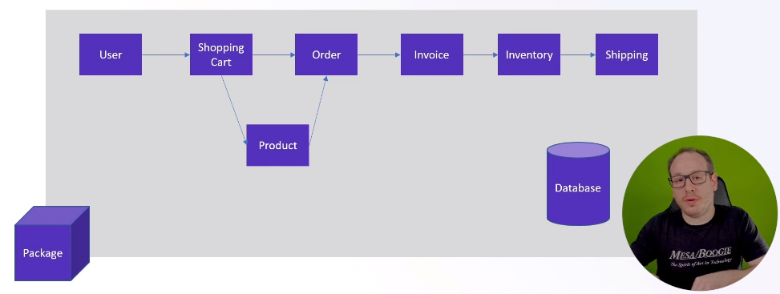

<h1>Fundamentos dos Microsserviços</h1>

> O conteúdo também foi organizado nos **commits**

<!--#region Sumário -->

<!--#region Fundamentos -->

Fundamentos

<ul>
    <li><a href="#ms-01">Apresentação</a></li>
    <li><a href="#ms-02">Agenda</a></li>
    <li><a href="#ms-03">Introdução</a></li>
    <li><a href="#ms-04">O que são microsserviços</a></li>
    <li><a href="#ms-05">Qual o tamanho ideal de um microsserviço</a></li>
    <li><a href="#ms-06">O que são serviços</a></li>
    <li><a href="#ms-07">Cultura</a></li>
    <li><a href="#ms-08">Monolíticos</a></li>
    <li><a href="#ms-09">Microsserviços e DDD</a></li>
    <li><a href="#ms-10">Microsserviços e Cultura</a></li>
    <li><a href="#ms-11">Armazenamento</a></li>
    <li><a href="#ms-12">Transações</a></li>
    <li><a href="#ms-13">Comunicação</a></li>
    <li><a href="#ms-14">Protocolos</a></li>
    <li><a href="#ms-15">APIs e Contratos</a></li>
    <li><a href="#ms-16">Distribuição</a></li>
    <li><a href="#ms-17">Circuit Breaker e Retry Pattern</a></li>
    <li><a href="#ms-18">Gateway</a></li>
    <li><a href="#ms-19">Segurança</a></li>
    <li><a href="#ms-20">Escala</a></li>
    <li><a href="#ms-21">Disponibilidade</a></li>
    <li><a href="#ms-22">Monitoramento - Parte 1</a></li>
    <li><a href="#ms-23">Monitoramento - Parte 2</a></li>
    <li><a href="#ms-24">Conclusão</a></li>
</ul>

<!--#endregion -->

<!--#endregion -->

<!--#region Fundamentos -->

<h2>Fundamentos</h2>

<!--#region Apresentação -->

Apresentação

 

Objetivos
- Não é sobre código
- Monolitos e Microsserviços
- Cultura
- Desafios
- Benefícios
- Drawbacks

<!--#endregion -->

<!--#region Agenda -->

Agenda

 

O que vamos debater...
- Monolíticos VS Microsserviços
- Organização e Cultura
- Armazenamento
- Serviços e Serviços Distribuídos
- Segurança
- Escala
- Disponibilidade
- Monitoramento
- Deploy

<!--#endregion -->

<!--#region Introdução -->

Introdução

 

Introdução:
- Se escreve microsserviços
- Arquitetura de microsserviços
- Microsserviço é um item de uma solução
- Não se trata apenas de código
- Não está limitado a tecnologia
    - "Microsserviços com ASP.NET Core" não existe
- Não tem exemplo de Microsserviços
- Implementação é diferente de design
- Estamos falando sobre sistemas realmente grandes
- Complexo e caro

<!--#endregion -->

<!--#region O que são microsserviços -->

O que são microsserviços

 

O que são?
- Determina um modelo de desenvolvimento
- Também é um conjunto de práticas
- Aumenta a velocidade do desenvolvimento
- Permite escalabilidade
- Agnóstico de tecnologias
- Princípios e padrões de arquitetura

<!--#endregion -->

<!--#region Qual tamanho ideal de um microsserviço -->

Qual tamanho ideal de um microsserviço

 

- Micro
    - Não dá para mensurar o tamanho
    - Não tem uma medida padrão
- Faz apenas uma coisa, e bem
- Micro se refere ao escopo e funcionalidades, não a quantidade de código
- Desenhado sob uma necessidade de negócio
- Que age totalmente independente
    - Incluindo o deploy
- Poder ser assimilado a um Bounded Context
- É o ato de divir um domínio em sub-domínios e finalmente em contextos delimitados

<!--#endregion -->

<!--#region O que são serviços -->

O que são serviços

 

- Um componente independente e "deployável" (publicável)
    - Baseado em um contexto delimitado
- Provê interoperabilidade
    - Através de comunicação via mensagens, requisição HTTP/S etc.
- SOA (Arquitetura Orientada a Serviços) Granularidade de serviços

> O servição não é necessariamente uma API

<!--#endregion -->

<!--#region Cultura -->

Cultura

 

**Impacto na cultura da empresa**
- Quanto maior o software, maior seu ciclo de vida
- Mais tempo o produto leva para ficar pronto
- Mais pessoas tem que trabalhar no time
- Mais complexo fica o projeto
- Mais difícil ficam as mudanças
- Mais engessado o projeto fica
    - Você pode experimentar tecnologias novas em projetos menores
    - Se não ficar bom, você perdeu pouco tempo

> Maior possibilidade de **NO GO**

<!--#endregion -->

<!--#region Monolíticos -->

Monolíticos

 

**Exemplo de eCommerce**
- Um usuário adiciona produtos a um carrinho
- O carrinho é salvo
- O usuário finaliza a compra
- É gerado um pedido
- É gerada a nota fiscal
- É feita a movimentação de estoque
- É realizada a entrega

**Mesmo assim**
- Podemos escalar
    - Múltiplas instâncias
- Podemos expor APIs ou criar uma UI acoplada
- É um arquitetura amplamente usada
- Eficiente
- Mais por que mudar?

**Escaláveis**

**Prós**

- Simples de desenvolver
    - Mesmo banco, tecnologia, time
- simples para *buildar*
- Simples para testar
- Simples para publicar (deploy)
- Simples de escalar

**Contras**

- Quanto maior mais difícil de ser produtivo
    - Novos membros demoram a se familizarizar
- Time fica grande
    - Precisa dividir os times
    - Ainda assim não conseguem agir independentes
- Código vira bagunça
- Engessa novas tecnologias
    - Visto que mudanças sempre causam dor
- Escala tudo ou nada
    - Black Friday
    - Quanto maior o App mais recurso usa, mais demora pra subir
- Banco de dados cresce junto

<!--#endregion -->

<!--#region Microsserviços e DDD -->

Microsserviços e DDD

 

**DDD e Microsserviços**

- Podemos correlacionar
- Domínio
    - Refere-se ao todo
- Sub-domínio
    - Uma parte do domínio
        - Usuário, pedido, produto, inventário
- Contexto delimitado
    - Capacidade de negócio
    - Um bom candidato a um microsserviço

Domínio: E-commerce

**Dependências**

- Os microsserviços devem agir independentemente
- Porém, um pedido "pertence" a um usuário
- O DDD tem uma abordagem de replicação de entidade
- Com entidades separadas, podemos especializá-las
    - Usuário, no contexto
        - **User** tem foto, redes sociais etc.
        - **Order** só tem o e-mail

> Pode-se ter entidades com mesmo nome, em contextos diferentes, com significados diferentes

Focado em reutilização de código, sem duplicidade.

<!--#endregion -->

<!--#region Microsserviços e Cultura -->

Microsserviços e Cultura

 

**Impacto na organização**

- Um time por sub-domínio
- Mais focado em uma coisa, mais especialista
- Tamanho do time varia de acordo com o tamanho do sub-domínio
- Responsável pelo ciclo de vida completo
    - Desenvolvimento ao **deploy**
- **Agile** e **DevOps** são fundamentais
- Não dispensa uma pessoa para cuidar de tudo
    - Orquestração dos times
- Cada time tem seu **wiki**, **codebase** etc.
- Versionamento é muito importante

> Não tem como entregar valor sem conhecer o negócio

<!--#endregion -->

<!--#endregion -->
